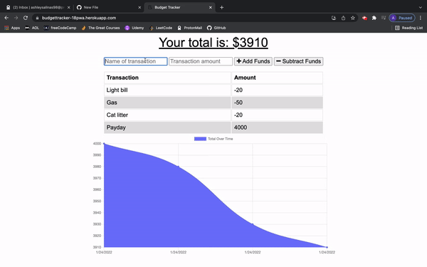

# Budget Tracker

Week 18 - PWA assignment for the Trilogy/Southern Methodist University Web Development Bootcamp

## About
This project was created for Week 11 - Express of the Trilogy/Southern Methodist University Web Development Bootcamp. It is web application that allows users to keep track of their spending and income while visualing the data. The app can be run offline thanks to IndexedDB, a service worker, and other client-side technologies.

## Built With
  * Service Worker
  * IndexedDB
  * MongoDB
  * ExpressJS

## Getting Started
  The deployed version of the app can be found <a href="https://budgettracker-18pwa.herokuapp.com/">here</a>.
  
 ## Usage
 Use this app to keep track of your expenses.
 
 ## Contributing
 Shout out to the team at Trilogy for providing the intial files for developemnt.
 
 ## License
 Distributed under the MIT Licencse.
